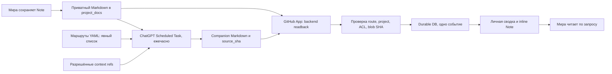

# Почасовой анализ проектных заметок через ChatGPT

**Статус:** отдельная необязательная capability Projects Hub. Она не заменяет Миру, Live, Gemini-структурирование, Kimi/DeepSeek или owner-development.

## Сквозная схема



### Что является исходником

- Приватный репозиторий: `onedayonemasterpiece/projects-hub-notes`.
- Роутер: `automation/chatgpt-note-analysis.yaml`, ветка `main`.
- В маршруте указан реальный `source_path` типа `docs/notes/34/note-...md`, `note_id`, `project_id`, `result_path`, `focus`, точные `context`-ссылки на другие разрешённые документы.
- **Только enabled-маршруты.** Обновление YAML определяет, что обрабатывать; автоматическая отправка всего нового личного/проектного контента не происходит.
- Фактическая редакция заметки — Git blob SHA исходного Markdown, не дата/заголовок. Источник не переписывается.

### Как работает часовой ChatGPT-task

Активная Scheduled Task `ChatGPT-анализ заметок Projects Hub` выполняет один проход каждый час. Проверяет YAML, затем не более `max_notes_per_run` активных маршрутов. Если companion-файл уже содержит полный `source_sha` исходника и завершённый статус — ничего не перезаписывает и не присылает повторного уведомления.

Для нового или изменённого текста читает только source и указанные `context`-документы, анализирует смысл, риски, противоречия, возможные варианты, предложения и вопросы. Результат — отдельный `*.chatgpt-analysis.md` рядом с заметкой в **том же приватном репозитории**. Редактирование исходного Markdown одновременно с анализом не должно приводить к публикации устаревшего результата.

Результат начинается с простого, машинно проверяемого frontmatter:

```yaml
---
analysis_schema: projects-hub-chatgpt-v1
route_id: phb-owner-collaboration-foundation
note_id: note_...
project_id: prj_...
source_path: docs/notes/34/note-....md
source_sha: <40 hex chars of source Git blob>
audience: project
status: completed
provider: chatgpt_scheduled
generated_at_utc: 2026-10-07T21:27:04Z
---
```

Все рекомендации аналитики — **предложения**, не принятые решения, поручения или разрешения на разработку.

### Backend-адаптер

`ChatGPTNoteAnalysisSync` в `src/projects_hub/chatgpt_note_analysis.py` использует **имеющийся** `GitHubConnections.read_repository_path` и существующие project-grants. `CollaborationAnalysisService` вызывает его из того же ограниченного фонового worker; нет нового broker, самостоятельного ASR/LLM и второго хранилища заметки.

Адаптер читает манифест только через приватный привязанный `project_docs` GitHub App repository. При импорте проверяет:
- `enabled` + version YAML, identity маршрута, безопасные относительные пути;
- реальную приватность хранилища и текущую авторизацию актора;
- `note_id`, `project_id`, оригинальный `source_path`;
- `audience: project`, `provider`, `status: completed`, полный source SHA;
- **повторный source readback** перед импортом, чтобы исключить гонку редакции.

Уникальный ключ `(note_id, source_sha)` препятствует дублированию событий при рестарте worker и повторном GitHub GET. Запись индекса результата и событие `note_chatgpt_analyzed` выполняются одной SQLite-транзакцией. Сам анализ остаётся companion-файлом с историей Git; в БД лежит read projection и адресованное событие.

**Мира** получает `note.chatgpt_analysis` через уже существующий `project_note_get`. **UI** показывает разворачиваемый блок в проектной заметке и личное событие автору. Доступ к результату равен текущему project ACL, не открывает чужую личную переписку. Закрытый клиент не мешает импорту.

### Как поставить ещё одну заметку

Добавьте ещё один элемент `routes` в приватный YAML: уникальный `id`, реальные `note_id` и `project_id`, путь исходного `.md`, companion-путь с суффиксом `.chatgpt-analysis.md`, `enabled: true` и разрешённый список `context`. Нет необходимости перезапускать backend. Для паузы поставьте `enabled: false`.

Манифест может редактировать владелец через подключённый GitHub/ChatGPT. Внутренний GitHub App binding с `allowed_paths=["docs/notes"]` намеренно не расширяется ради редактирования маршрутизатора. Маршрут — конфигурация, а не разрешение на произвольный доступ к другим проектам.

### Уведомления и приёмка

ChatGPT Tasks может прислать push/сообщение **самого ChatGPT**, если уведомления включены и GitHub write разрешён. Projects Hub получает отдельное **личное in-app событие** после проверенного импорта; это не означает, что нативный Android system push уже реализован. Мира может зачитать результат после авторизованного `project_note_get`.

Для проверки вручную владелец может вызвать `POST /api/collaboration/chatgpt/sync` с `{"workspace_id":"..."}`. Этот endpoint не запускает модель и не редактирует репозиторий — только выполняет повторный импорт и возвращает число новых результатов. Встроенный worker обычно обнаруживает новые companion-файлы без такого вызова.

Обязательные проверки: первый pilot sidecar → readback → импорт → одно личное событие; повтор импорта без дублей; stale source blob → отказ; ACL deny для стороннего участника; read из UI/через Миру; restart после публикации; непринятие предложений модели за утверждённые задачи.

**Ограничение:** штатный GitHub-подключаемый task может запросить подтверждение записи. Если необходимого разрешения нет, он должен остановиться, а не обходить права. Нельзя заявлять end-to-end доставку в приложении, пока verified deployed SHA и реальная проверка импорта не подтверждены.
